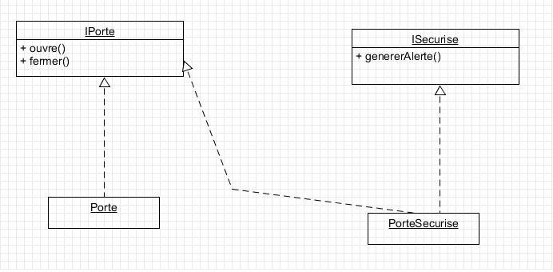
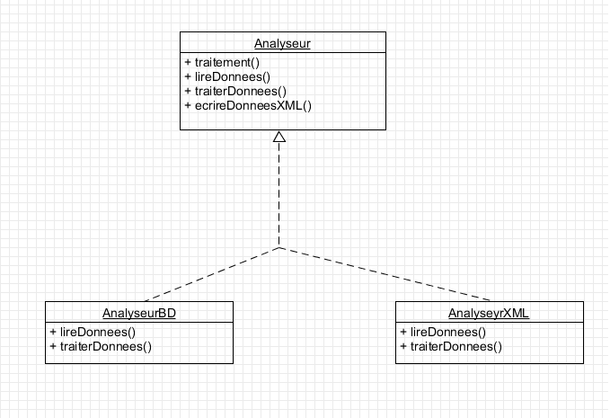

# Exercice 1 

1. Réduire le coût de la maintenance et faciliter la modification du code.  
Rendre les modules de notre application indépendants et ainsi faciliter son développement et ses tests.  
Les Design Pattern permettent souvent ce genre de séparation  
-> Les modeles MVC permet de séparer le model de leurs représentation et interaction

2. Le couplage est une métrique indiquant le niveau d'interaction entre 2 ou plusieurs composants logiciels.  
Deux composants sont couplé s'ils échangent de l'information.
    - Couplage fort (serré) si les composants échangent bcp d'information
    - Couplage faible (léger, lâche) si les composants échangent bcp d'information 

Un couplage Fort pose plusieurs problemes : Antipattern plat de spaghetti : on ne peut pas determiner le qui, le quoi et le comment d'une modification.

Un couplage Faible indépendace fonctionnelle :
    - Composant logiciel difficilement réutilisable
    - Composant logiciel difficilement Testable

# Exercice 2

Les intérêts de l'injection de dépendance
1. Permet de ne pas créer ses objets soi-même.
2. Permet de faciliter les tests
3. Permet d'améliorer la modularité d'un projet

        public inteerface Fruit{
            public double getPrix();
        }

        public class Orange implements Fruit{
            private double prix;
            private String origine;

            public Orange(){
                this.prix = 0;
                this.origine = "Espagne";
            }

            public double getPrix(){
                return prix;
            }
        }

        public class Banane implements Fruit{
            private double prix;
            private String origine;

            public Banane(){
                this.prix = 1;
                this.origine = "Cameroun";
            }

            public double getPrix(){return this.prix;}
        }

        public class Panier{
            private Fruit f;
            private double nb_Kilo;

            public Panier(Fruit newF, double newNb_Kilo){
                this.f = newF;
                this.nb_Kilo = newNb_Kilo;
            }

            public Panier(Fruit newF){
                this.f = newF;
                this.nb_Kilo = 1;
            }

            public double getPrix(){
                return f.getPrix()*nb_Kilo;
            }
            
            public void setFruit(Fruit newF){
                this.f = newF;
            }
        }

        public interface Fabrique{
            public Fruit fabriquer();
        }

        public class FabriqueOrange implements Fabrique{

            public Fruit fabriquer(){
                return newOrange();
            }
        }

        public class FabriqueBanane implements Fabrique{

            public Fruit fabriquer(){
                return newBanane();
            }
        }

        public class Test{
            
            public static void main(String args[]){
                Fruit or = new Orange();
                Fruit bn = new Banane();

                Fruit or = new FabriqueOrange.fabriquer();
                Fruit bn = new FabriqueBanane().fabriquer();

                Panier p1 = new Panier(or, 3);
                Panier p2 = new Panier(bn, 5);

                //methodes de test
            }
        }

# Exercice 3

## Partie 2

        public void traitement(){
            LireDonnees();
            traiterDonnees();
            ecrireDonneesXML();
        }

